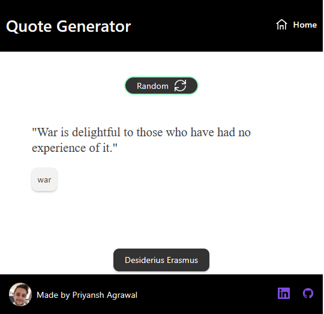

<!-- Please update value in the {}  -->

<h1 align="center">Quote Generator</h1>

<div align="center">
   Solution for a challenge from  <a href="http://devchallenges.io" target="_blank">Devchallenges.io</a>.
</div>

<div align="center">
  <h3>
    <a href="https://agrawpri.github.io/quote-generator/">
      Demo
    </a>
    <span> | </span>
    <a href="https://github.com/agrawpri/quote-generator">
      Solution
    </a>
    <span> | </span>
    <a href="https://devchallenges.io/challenges/8Y3J4ucAMQpSnYTwwWW8">
      Challenge
    </a>
  </h3>
</div>

## Table of Contents

- [Overview](#overview)
  - [Built With](#built-with)
- [Features](#features)
- [How to use](#how-to-use)
- [Contact](#contact)
- [Acknowledgements](#acknowledgements)

## Overview



A web application which displays randomly generated quotes. One can also view quotes by a given author/speaker.

The app can be accessed at https://agrawpri.github.io/quote-generator/.

### Built With

- [React](https://reactjs.org/)

## Features

This application/site was created as a submission to a [DevChallenges](https://devchallenges.io/challenges) challenge. The [challenge](https://devchallenges.io/challenges/8Y3J4ucAMQpSnYTwwWW8) was to build an application to complete the given user stories.

The following features have been implemented:
- Generating random quotes on-demand.
- Viewing all quotes by the author of the current quote.

The following features are expected to arrive in the future:
- Searching for quotes by authors using an auto-complete input field for the authors.


## How To Use

To clone and run this application, you'll need [Git](https://git-scm.com) and [npm](https://www.npmjs.com/) installed on your computer. From your command line:

```bash
# Clone this repository
$ git clone https://github.com/agrawpri/quote-generator

# Install dependencies
$ npm install

# Build the app
$ npm run build

# Run the app
$ npm run start
```

The app should then be accessible on http://localhost:3000/

## Acknowledgements

- [Make react-router work with GitHub Pages](https://stackoverflow.com/a/71985764/5019181)
- [HTML Webpack Plugin](https://webpack.js.org/plugins/html-webpack-plugin/)
- [Grommet for layout and styling](https://v2.grommet.io/)

## Contact

- LinkedIn [@priyansh-agrawal](https://www.linkedin.com/in/priyansh-agrawal/)
- GitHub [@Priyansh121096](https://github.com/Priyansh121096)
